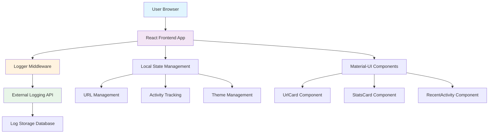
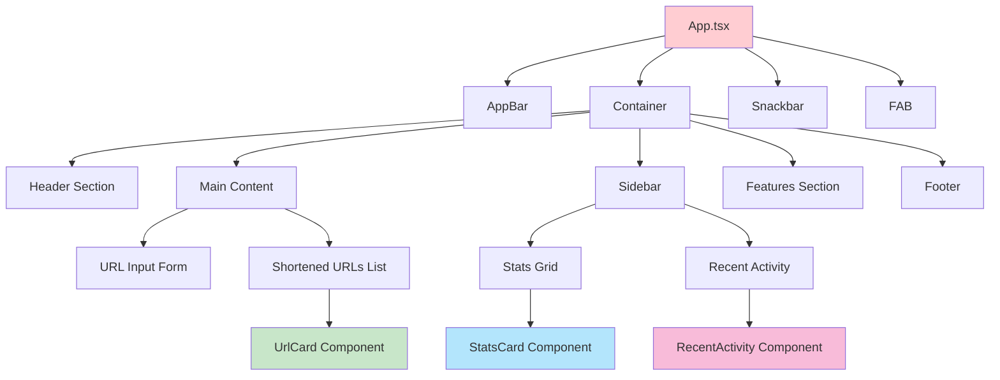
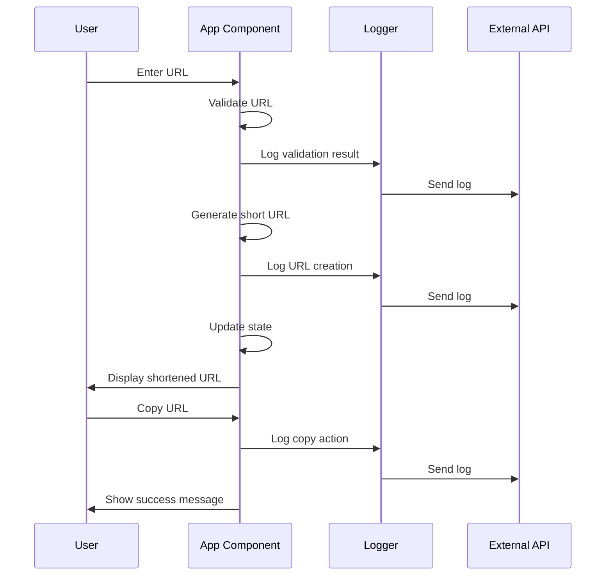
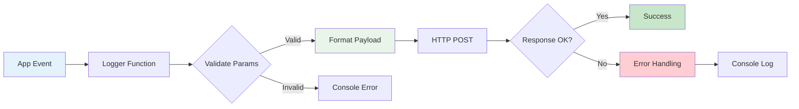

# Architecture Diagrams

## System Architecture Flow

```mermaid
graph TB
    A[User Browser] --> B[React Frontend App]
    B --> C[Material-UI Components]
    B --> D[Logger Middleware]
    D --> E[External Logging API]
    E --> F[Log Storage Database]

    B --> G[Local State Management]
    G --> H[URL Management]
    G --> I[Activity Tracking]
    G --> J[Theme Management]

    C --> K[UrlCard Component]
    C --> L[StatsCard Component]
    C --> M[RecentActivity Component]

    style A fill:#e1f5fe
    style B fill:#f3e5f5
    style D fill:#fff3e0
    style E fill:#e8f5e8
```

## Component Hierarchy

```mermaid
graph TD
    A[App.tsx] --> B[AppBar]
    A --> C[Container]
    A --> D[Snackbar]
    A --> E[FAB]

    C --> F[Header Section]
    C --> G[Main Content]
    C --> H[Sidebar]
    C --> I[Features Section]
    C --> J[Footer]

    G --> K[URL Input Form]
    G --> L[Shortened URLs List]

    L --> M[UrlCard Component]

    H --> N[Stats Grid]
    H --> O[Recent Activity]

    N --> P[StatsCard Component]
    O --> Q[RecentActivity Component]

    style A fill:#ffcdd2
    style M fill:#c8e6c9
    style P fill:#b3e5fc
    style Q fill:#f8bbd9
```

## Data Flow Diagram

```mermaid
sequenceDiagram
    participant U as User
    participant A as App Component
    participant L as Logger
    participant API as External API

    U->>A: Enter URL
    A->>A: Validate URL
    A->>L: Log validation result
    L->>API: Send log

    A->>A: Generate short URL
    A->>L: Log URL creation
    L->>API: Send log

    A->>A: Update state
    A->>U: Display shortened URL

    U->>A: Copy URL
    A->>L: Log copy action
    L->>API: Send log
    A->>U: Show success message
```

## Logging Flow

```mermaid
graph LR
    A[App Event] --> B[Logger Function]
    B --> C{Validate Params}
    C -->|Valid| D[Format Payload]
    C -->|Invalid| E[Console Error]
    D --> F[HTTP POST]
    F --> G{Response OK?}
    G -->|Yes| H[Success]
    G -->|No| I[Error Handling]
    I --> J[Console Log]

    style A fill:#e3f2fd
    style D fill:#e8f5e8
    style H fill:#c8e6c9
    style I fill:#ffcdd2
```
