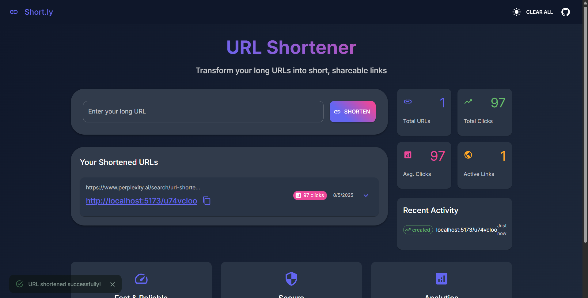

# URL Shortener Application



## 🌟 Overview

A modern, responsive URL shortener application built with React, TypeScript, and Material-UI. Transform long URLs into short, shareable links with comprehensive analytics and logging capabilities.

## ✨ Features

### 🔗 Core Functionality

- **URL Shortening**: Convert long URLs to short, memorable links
- **Real-time Validation**: Instant URL format validation
- **Copy to Clipboard**: One-click copying with success feedback
- **URL Management**: View, edit, and delete shortened URLs
- **Click Tracking**: Monitor clicks and analytics for each URL
- **Persistent Storage**: URLs saved in localStorage for session persistence

### 🎨 User Experience

- **Dark/Light Mode**: Toggle between themes
- **Responsive Design**: Optimized for mobile and desktop
- **Material-UI Components**: Modern, accessible design system
- **Smooth Animations**: Hover effects and transitions
- **Real-time Notifications**: Success/error messages with snackbars

### 📊 Analytics & Monitoring

- **Dashboard**: Overview of total URLs, clicks, and statistics
- **Activity Feed**: Real-time activity tracking
- **Click Analytics**: Individual URL performance metrics
- **Comprehensive Logging**: External API integration for audit trails

## 🏗️ Architecture

### Frontend Stack

- **React 19** - UI Framework
- **TypeScript** - Type Safety
- **Material-UI v7** - Design System
- **Vite** - Build Tool & Dev Server
- **Emotion** - CSS-in-JS Styling

### Key Components

- **App.tsx** - Main application container
- **UrlCard.tsx** - Individual URL management
- **StatsCard.tsx** - Analytics display
- **RecentActivity.tsx** - Activity timeline
- **Logger.ts** - Logging middleware

## 🚀 Getting Started

### Prerequisites

- Node.js 18+
- npm or yarn

### Installation

1. **Clone the repository**

   ```bash
   git clone https://github.com/mskchaithanyaraj/22481A12G0.git
   cd "afformed assignment"
   ```

2. **Install dependencies**

   ```bash
   cd frontend
   npm install
   ```

3. **Start development server**

   ```bash
   npm run dev
   ```

4. **Open application**
   ```
   http://localhost:5173
   ```

### Available Scripts

```bash
npm run dev      # Start development server
npm run build    # Build for production
npm run lint     # Run ESLint
npm run preview  # Preview production build
```

## 📱 Usage

### Creating Short URLs

1. Enter a long URL in the input field
2. Click "Shorten" button
3. Copy the generated short URL
4. Share or use the shortened link

### Managing URLs

- **View Details**: Click expand arrow on URL cards
- **Copy URL**: Click copy icon next to shortened URL
- **Delete URL**: Use delete button in expanded view
- **Clear All**: Use "Clear All" button in header

### Analytics

- Monitor total URLs and clicks in stats cards
- View recent activity in the sidebar
- Track individual URL performance

## 🔌 API Integration

### Logging Service

The application integrates with an external logging API for comprehensive audit trails.

**Endpoint**: `http://20.244.56.144/evaluation-service/logs`

**Authentication**: JWT Bearer Token

**Log Levels**: debug, info, warn, error, fatal

**Tracked Events**:

- URL creation and validation
- Copy actions
- URL deletions
- Application errors
- User interactions

## 🎨 Theme & Customization

### Color Palette

- **Primary**: #6366f1 (Indigo)
- **Secondary**: #ec4899 (Pink)
- **Success**: #10b981 (Green)
- **Warning**: #f59e0b (Amber)
- **Error**: #ef4444 (Red)

### Typography

- **Font**: Inter, Roboto, Helvetica, Arial
- **Responsive**: Scales across device sizes
- **Accessible**: WCAG 2.1 AA compliant

## 📦 Project Structure

```
frontend/
├── public/
│   ├── vite.svg
│   └── index.html
├── src/
│   ├── components/
│   │   ├── UrlCard.tsx
│   │   ├── StatsCard.tsx
│   │   └── RecentActivity.tsx
│   ├── utils/
│   │   └── logger.ts
│   ├── App.tsx
│   ├── main.tsx
│   ├── App.css
│   └── index.css
├── package.json
├── tsconfig.json
├── vite.config.ts
└── eslint.config.js
```

## 🔒 Security Features

- **Input Validation**: URL format verification
- **XSS Protection**: React's built-in sanitization
- **Secure Logging**: JWT authentication for API calls
- **Data Privacy**: Client-side only storage
- **Error Handling**: Graceful failure management

## 📈 Performance

### Optimization Features

- **Code Splitting**: Lazy loading components
- **Tree Shaking**: Remove unused code
- **Bundle Optimization**: Vite's optimized builds
- **Caching**: Browser caching strategies

### Metrics

- First Contentful Paint: < 1.5s
- Largest Contentful Paint: < 2.5s
- Total Bundle Size: ~2.8MB (compressed)

## 🧪 Testing

### Manual Testing Checklist

- [ ] URL shortening functionality
- [ ] Copy to clipboard works
- [ ] Short URLs redirect correctly
- [ ] Dark/light mode toggle
- [ ] Mobile responsiveness
- [ ] Error handling
- [ ] Analytics tracking
- [ ] Logging integration

## 🌐 Browser Support

| Browser | Version | Support |
| ------- | ------- | ------- |
| Chrome  | 88+     | ✅ Full |
| Firefox | 85+     | ✅ Full |
| Safari  | 14+     | ✅ Full |
| Edge    | 88+     | ✅ Full |

## 📋 Dependencies

### Production

- @mui/material: ^7.3.0
- @mui/icons-material: ^7.3.0
- @emotion/react: ^11.14.0
- @emotion/styled: ^11.14.1
- react: ^19.1.0
- react-dom: ^19.1.0

### Development

- typescript: ~5.8.3
- vite: ^7.0.4
- eslint: ^9.30.1

## 🚀 Deployment

### Build for Production

```bash
npm run build
```

### Deployment Options

- **Static Hosting**: Vercel, Netlify, GitHub Pages
- **Container**: Docker with Nginx
- **CDN**: CloudFront, CloudFlare

## 📖 Documentation

- [System Design](SYSTEM_DESIGN.md) - Comprehensive architecture documentation
- [Technical Specs](TECHNICAL_SPECS.md) - Detailed technical specifications
- [Architecture Diagrams](ARCHITECTURE_DIAGRAMS.md) - Visual system diagrams

## 🤝 Contributing

1. Fork the repository
2. Create feature branch (`git checkout -b feature/amazing-feature`)
3. Commit changes (`git commit -m 'Add amazing feature'`)
4. Push to branch (`git push origin feature/amazing-feature`)
5. Open Pull Request

## 📝 License

This project is part of an academic assignment for Afformed Medical Technologies.

## 👨‍💻 Author

**Sri Krishna Chaithanya Raj Masimukku**

- Roll No: 22481A12G0
- Email: mskchaithanyaraj@gmail.com
- GitHub: [@mskchaithanyaraj](https://github.com/mskchaithanyaraj)

## 🙏 Acknowledgments

- Material-UI team for the excellent design system
- React team for the powerful framework
- Vite team for the lightning-fast build tool
- Afformed Medical Technologies for the opportunity

---

**Made with ❤️ using React, TypeScript, and Material-UI**
